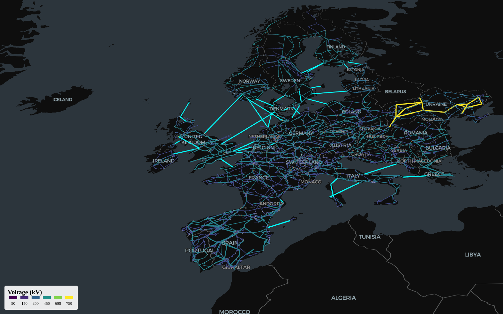

# PyPSA‑Eur Map Viewer

Interactive viewer for the European high-voltage electricity network, based on the public PyPSA-Eur dataset (DOI 10.5281/zenodo.14144752).

https://zenodo.org/records/14144752

## About the PyPSA-Eur Dataset

The PyPSA-Eur dataset is an open-source model of the European high-voltage electricity transmission network. It includes detailed information on substations, AC lines, HVDC links, transformers, and converters for 37 European countries. The dataset is designed for energy system analysis and research, and is widely used in academic and industry studies.

- **Source:** [PyPSA-Eur on Zenodo](https://zenodo.org/record/14144752)
- **Version:** v0.8.0 (latest as of July 2025)
- **License:** [MIT License](https://opensource.org/licenses/MIT)
- **Authors:** Fabian Neumann, Jonas Hörsch, Tom Brown, et al.
- **Coverage:** 37 European countries, including detailed grid topology, line parameters, and generation data.
- **Citation:**
  > Fabian Neumann, Jonas Hörsch, Tom Brown (2024). PyPSA-Eur: An Open Optimisation Model of the European Transmission System. Zenodo. https://doi.org/10.5281/zenodo.14144752

For more details, see the [official documentation](https://pypsa-eur.readthedocs.io/).

## What does this project do?

This project is a technical proof of concept to configure Deck.gl and MapLibre GL for interactive map visualization, using the public PyPSA-Eur dataset. It allows you to explore the European electricity network data on a map, filter by voltage and link type, and demonstrates how to efficiently process and render large geospatial datasets in the browser.



## Live Demo

You can view the project running on GitHub Pages at the following URL:

[https://oalles.github.io/pypsa-eur-map-viewer/](https://oalles.github.io/pypsa-eur-map-viewer/)

This demo allows you to explore the application directly in your browser, without needing to install anything locally.

## Data loading workflow

Before starting the application, you need to download and prepare the data. Use the following script:

```bash
pnpm exec node scripts/fetch-data.mjs
```

This script downloads the required CSV files (buses, lines, links, transformers, converters) from Zenodo and saves them in `public/data/`. It also fixes the geometry format to ensure compatibility with the visualization.

**Important:** Run this script whenever you want to update the data or after cloning the repository.

## How is the data used?

- The downloaded CSV files are automatically transformed into GeoJSON collections when the app starts.
- Each element type (lines, buses, links, etc.) is rendered as a visual layer on the map using Deck.gl.
- You can filter by voltage range and show/hide HVDC links from the interface.

## Stack

* React 18 + TypeScript
* Zustand state
* MapLibre GL 3
* Deck.gl 9
* PapaParse CSV parser
* No backend – data fetched directly from Zenodo

## Development

```bash
pnpm install
pnpm exec node scripts/fetch-data.mjs # Download and prepare data
pnpm dev
```

## Deploy to GitHub Pages

```bash
pnpm deploy
```

The deploy script builds the app and pushes `dist/` to the `gh-pages` branch.
Make sure the repository name matches **pypsa-eur-map-viewer** or update `base` in `vite.config.ts`.

## Notes

* For performance, only the first 15,000 lines are loaded; you can adjust this limit in `hooks/useDataset.ts`.
* Zenodo allows CORS; if unavailable, you can proxy the CSV files.
