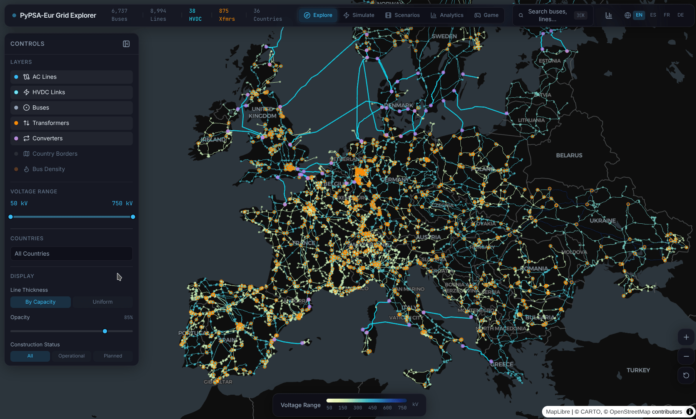
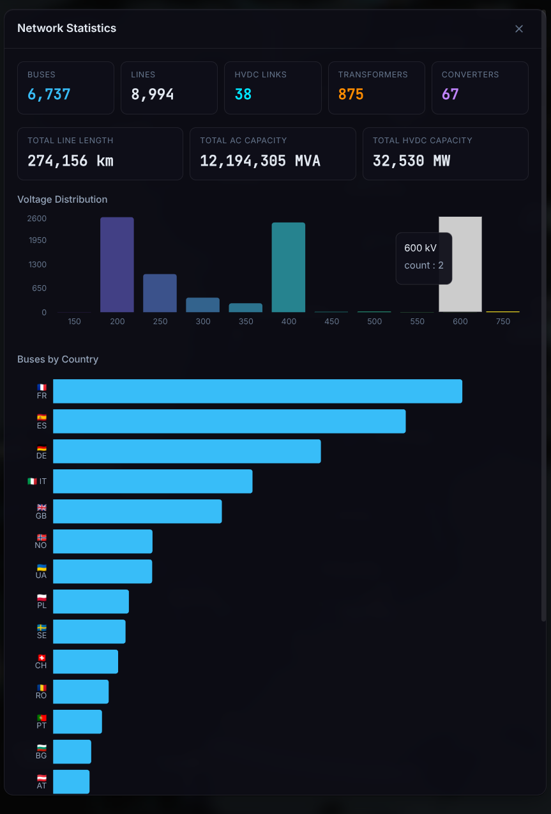

# PyPSA-Eur Grid Explorer

Interactive explorer for the European high-voltage electricity grid, built on the public PyPSA-Eur dataset (DOI 10.5281/zenodo.14144752).

## Live Demo

[https://oalles.github.io/pypsa-eur-map-viewer/](https://oalles.github.io/pypsa-eur-map-viewer/)



## About the PyPSA-Eur Dataset

https://zenodo.org/records/14144752

The PyPSA-Eur dataset is an open-source model of the European high-voltage electricity transmission network. It includes detailed information on substations, AC lines, HVDC links, transformers, and converters for 37 European countries. The dataset is designed for energy system analysis and research, and is widely used in academic and industry studies.

- **Source:** [PyPSA-Eur on Zenodo](https://zenodo.org/record/14144752)
- **Version:** v0.8.0 (latest as of July 2025)
- **License:** [MIT License](https://opensource.org/licenses/MIT)
- **Authors:** Fabian Neumann, Jonas Hörsch, Tom Brown, et al.
- **Coverage:** 37 European countries, including detailed grid topology, line parameters, and generation data.
- **Citation:**
  > Fabian Neumann, Jonas Hörsch, Tom Brown (2024). PyPSA-Eur: An Open Optimisation Model of the European Transmission System. Zenodo. https://doi.org/10.5281/zenodo.14144752

For more details, see the [official documentation](https://pypsa-eur.readthedocs.io/).

## Modes

The application has two main modes, selectable from the header:

### Explore

The default mode. Browse the European transmission grid interactively:

- **6 layer types** — AC lines, HVDC links, buses, transformers, converters, and heatmap
- **Advanced filtering** — dual-range voltage slider, multi-select country picker, construction status toggle
- **Detail panel** — click any element to see its properties (voltage, capacity, length, etc.)
- **Quick search** — Cmd+K / Ctrl+K command palette to find elements by name or ID
- **Statistics** — charts and summaries powered by Recharts
- **Color schemes** — switchable color palettes for network layers
- **Display controls** — line width, opacity, and point radius adjustments

### Simulate (new)

A topological blackout simulator. It models what happens when grid components fail: the network splits into islands, and each island is either **energized** (still connected to a power source) or in **blackout**.

**How it works:**

1. **Choose energy sources** — Select countries whose buses act as generation sources (all buses in those countries are marked as energized). Alternatively, switch to *Manual* mode and click individual buses on the map.
2. **Create faults** — Click buses, AC lines, or HVDC links on the map to simulate failures. These elements are removed from the grid graph.
3. **See the result** — The simulator runs a BFS connected-components algorithm (in a Web Worker) and colors the map: energized regions stay lit, disconnected regions go dark. Metrics show the number of components, blackout buses, and percentage affected.

> **Note:** This is a simplified topological model for educational purposes. It does not calculate real power flow, voltages, thermal limits, or protection system behavior. Sources are binary (on/off) with no generation capacity limits.

## Other Features

- **Internationalization** — EN, ES, FR, DE
- **Keyboard shortcuts** — quick toggles for layers and panels
- **Glassmorphic UI** — translucent overlay panels on a full-screen map

## Data loading workflow

Before starting the application, download and prepare the data:

```bash
pnpm exec node scripts/fetch-data.mjs
```

This script downloads the required CSV files (buses, lines, links, transformers, converters) from Zenodo and saves them in `public/data/`. It also fixes the geometry format to ensure compatibility with the visualization.

**Important:** Run this script whenever you want to update the data or after cloning the repository.

## How is the data used?

CSV files are loaded at startup and processed through a multi-stage pipeline:

1. **Parse** — PapaParse streams each CSV into typed rows
2. **Geometry** — WKT strings are parsed into coordinate arrays
3. **GeoJSON** — Rows are converted to GeoJSON Feature collections
4. **Store** — Zustand holds the full dataset and UI state
5. **Graph index** — An adjacency map is built from buses and edges (lines, links, transformers, converters) for the simulation engine
6. **Filter** — A memoized `useFilteredData` hook applies voltage, country, and construction filters
7. **Render** — Individual deck.gl layers (PathLayer, ScatterplotLayer, HeatmapLayer) consume the filtered features

## Stack

* React 18 + TypeScript
* Zustand (state management)
* MapLibre GL 3
* Deck.gl 9
* Tailwind CSS v4 (CSS-first config)
* Radix UI (accessible primitives)
* cmdk (command palette)
* i18next + react-i18next
* Recharts
* Lucide React (icons)
* PapaParse (CSV parsing)

## Development

```bash
pnpm install
pnpm exec node scripts/fetch-data.mjs   # download and prepare data
pnpm dev
```

## Deploy to GitHub Pages

```bash
pnpm deploy
```

The deploy script builds the app and pushes `dist/` to the `gh-pages` branch.
Make sure the repository name matches **pypsa-eur-map-viewer** or update `base` in `vite.config.ts`.

## Notes

* Zenodo allows CORS; if unavailable, you can proxy the CSV files.

## Statistics



